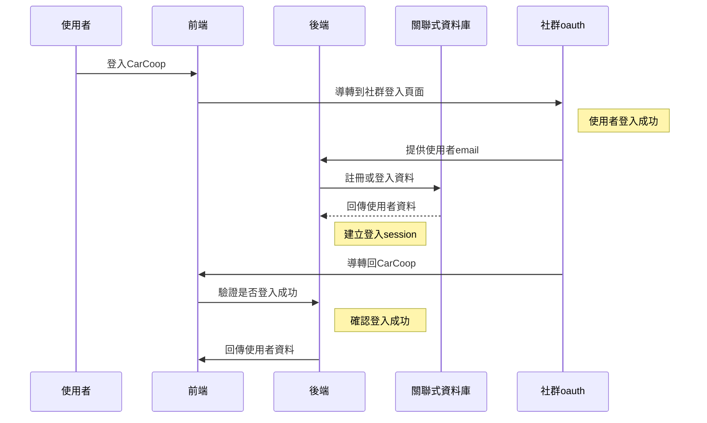
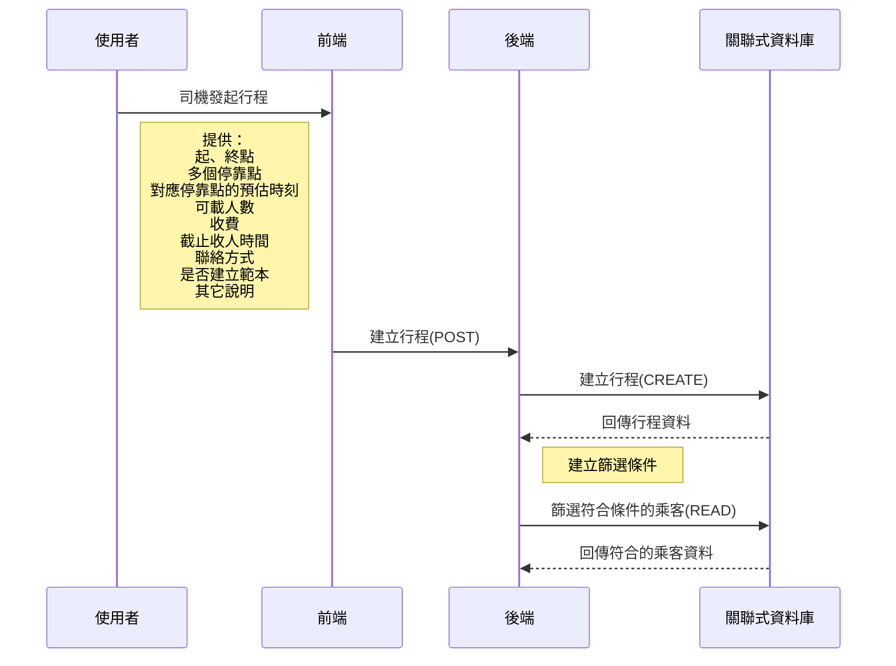
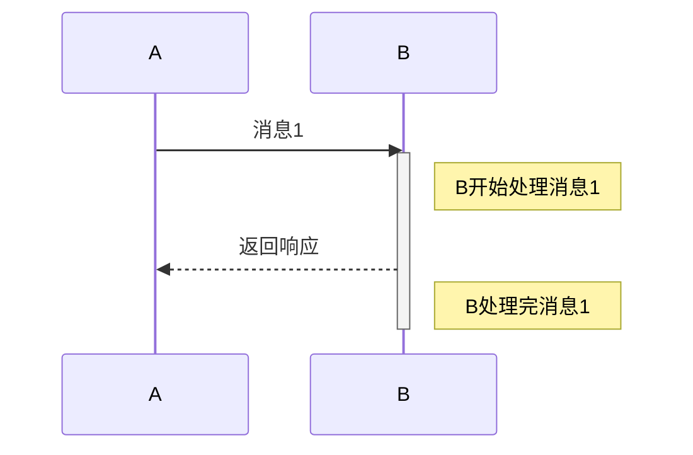

# 通勤共享專案

## 登入

```mermaid
sequenceDiagram
    participant 使用者
    participant 前端
    participant 後端
    participant 關聯式資料庫
    participant 社群oauth
    使用者->>前端:登入CarCoop
    前端->>社群oauth:導轉到社群登入頁面
    Note right of 社群oauth: 使用者登入成功
    社群oauth->>後端:提供使用者email
    後端->>關聯式資料庫:註冊或登入資料
    關聯式資料庫-->>後端:回傳使用者資料
    Note right of 後端: 建立登入session
    社群oauth->>前端:導轉回CarCoop
    前端->>後端:驗證是否登入成功
    Note right of 後端: 確認登入成功
    後端->>前端:回傳使用者資料
```

## 司機發起行程

```mermaid
sequenceDiagram
    使用者->>前端:司機發起行程
    Note right of 使用者:提供：<br>起、終點<br>多個停靠點<br>對應停靠點的預估時刻<br>可載人數<br>收費<br>截止收人時間<br>聯絡方式<br>是否建立範本<br>其它說明
    前端->>後端:建立行程(POST)
    後端->>關聯式資料庫:建立行程(CREATE)
    關聯式資料庫-->>後端:回傳行程資料
    Note right of 後端:建立篩選條件
    後端->>關聯式資料庫:篩選符合條件的乘客(READ)
    關聯式資料庫-->>後端:回傳符合的乘客資料

```

```mermaid
sequenceDiagram
    participant A
    participant B
    A->>B: 消息1
    activate B
    Note right of B: B开始处理消息1
    B-->>A: 返回响应
    Note right of B: B处理完消息1
    deactivate B
```

