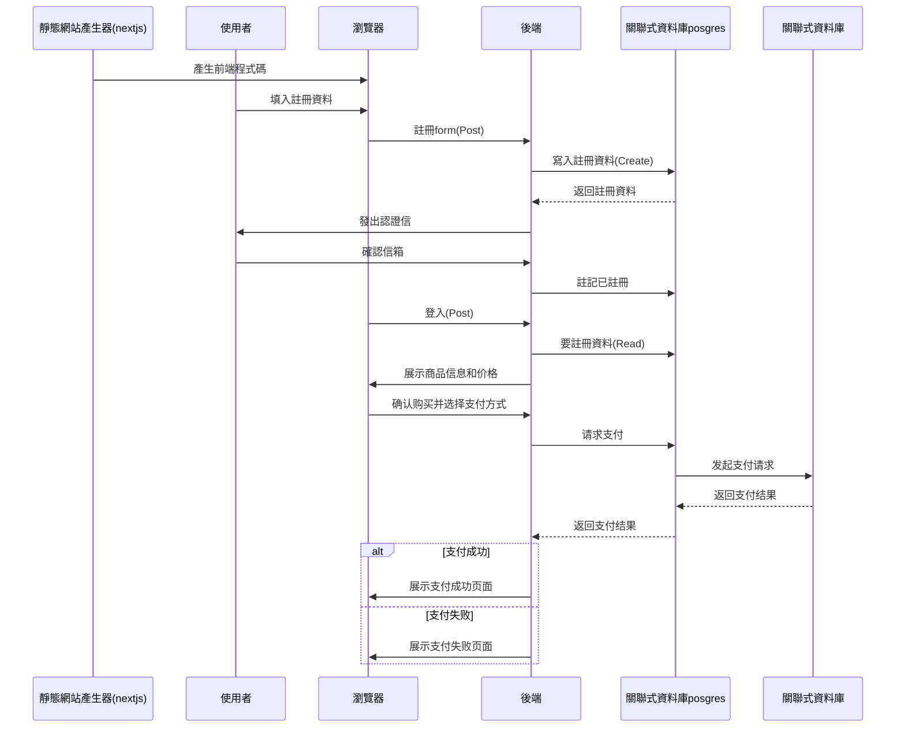

# 通勤共享專案

```mermaid
sequenceDiagram
    participant 靜態網站產生器(nextjs)
    participant 使用者
    participant 瀏覽器
    participant 後端
    participant 關聯式資料庫posgres
    participant 關聯式資料庫
    靜態網站產生器(nextjs)->>瀏覽器:產生前端程式碼
    使用者->>瀏覽器:填入註冊資料
    瀏覽器->>後端:註冊form(Post)
    後端->>關聯式資料庫posgres:寫入註冊資料(Create)
    關聯式資料庫posgres-->>後端:返回註冊資料
    後端->>使用者:發出認證信
    使用者->>後端:確認信箱
    後端->>關聯式資料庫posgres:註記已註冊
    瀏覽器->>後端:登入(Post)
    後端->>關聯式資料庫posgres:要註冊資料(Read)

    後端->>瀏覽器: 展示商品信息和价格
    瀏覽器->>後端: 确认购买并选择支付方式
    後端->>關聯式資料庫posgres: 请求支付
    關聯式資料庫posgres->>關聯式資料庫: 发起支付请求
    關聯式資料庫-->>關聯式資料庫posgres: 返回支付结果
    關聯式資料庫posgres-->>後端: 返回支付结果
    alt 支付成功
        後端->>瀏覽器: 展示支付成功页面
    else 支付失败
        後端->>瀏覽器: 展示支付失败页面
    end
```