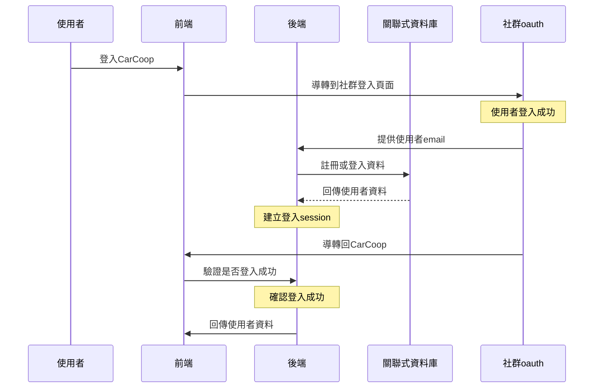
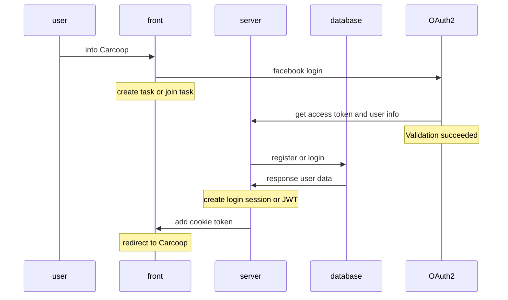
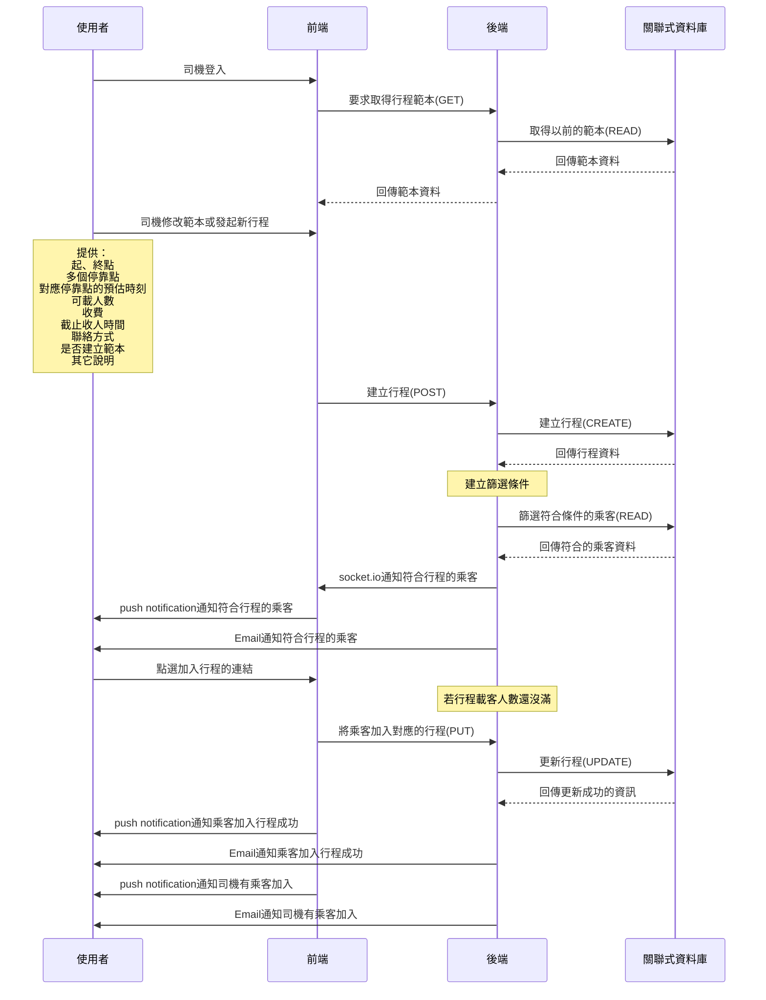
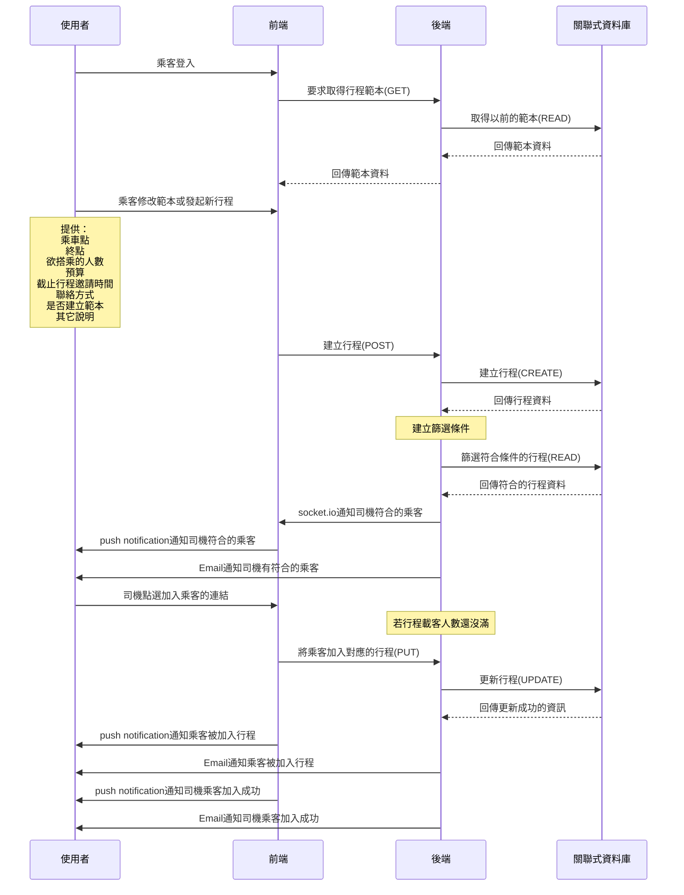

# 通勤共享專案

## 登入

```mermaid
sequenceDiagram
    participant 使用者
    participant 前端
    participant 後端
    participant 關聯式資料庫
    participant 社群oauth
    使用者->>前端:登入CarCoop
    前端->>社群oauth:導轉到社群登入頁面
    Note over 社群oauth: 使用者登入成功
    社群oauth->>後端:提供使用者email
    後端->>關聯式資料庫:註冊或登入資料
    關聯式資料庫-->>後端:回傳使用者資料
    Note over 後端: 建立登入session
    社群oauth->>前端:導轉回CarCoop
    前端->>後端:驗證是否登入成功
    Note over 後端: 確認登入成功
    後端->>前端:回傳使用者資料
```

## login by Herman

```mermaid
sequenceDiagram
    participant user
    participant front
    participant server
    participant database
    participant OAuth2
    user->>front: into Carcoop 
    front->>OAuth2: facebook login
    note over front: create task or join task
    OAuth2->>server: get access token and user info
    note over OAuth2: Validation succeeded
    server->>database: register or login
    database->>server: response user data
    note over server: create login session or JWT
    server->>front: add cookie token
    note over front: redirect to Carcoop
```

## 司機發起行程

```mermaid
sequenceDiagram
    participant 使用者
    participant 前端
    participant 後端
    participant 關聯式資料庫
    使用者->>前端:司機登入
    前端->>後端:要求取得行程範本(GET)
    後端->>關聯式資料庫:取得以前的範本(READ)
    關聯式資料庫-->>後端:回傳範本資料
    後端-->>前端:回傳範本資料
    使用者->>前端:司機修改範本或發起新行程
    Note over 使用者:提供：<br>起、終點<br>多個停靠點<br>對應停靠點的預估時刻<br>可載人數<br>收費<br>截止收人時間<br>聯絡方式<br>是否建立範本<br>其它說明
    前端->>後端:建立行程(POST)
    後端->>關聯式資料庫:建立行程(CREATE)
    關聯式資料庫-->>後端:回傳行程資料
    Note over 後端:建立篩選條件
    後端->>關聯式資料庫:篩選符合條件的乘客(READ)
    關聯式資料庫-->>後端:回傳符合的乘客資料
    後端->>前端:socket.io通知符合行程的乘客
    前端->>使用者:push notification通知符合行程的乘客
    後端->>使用者:Email通知符合行程的乘客
    使用者->>前端:點選加入行程的連結
    Note over 後端:若行程載客人數還沒滿
    前端->>後端:將乘客加入對應的行程(PUT)
    後端->>關聯式資料庫:更新行程(UPDATE)
    關聯式資料庫-->>後端:回傳更新成功的資訊
    前端->>使用者:push notification通知乘客加入行程成功
    後端->>使用者:Email通知乘客加入行程成功
    前端->>使用者:push notification通知司機有乘客加入
    後端->>使用者:Email通知司機有乘客加入
```

## 乘客發起行程

```mermaid
sequenceDiagram
    participant 使用者
    participant 前端
    participant 後端
    participant 關聯式資料庫
    使用者->>前端:乘客登入
    前端->>後端:要求取得行程範本(GET)
    後端->>關聯式資料庫:取得以前的範本(READ)
    關聯式資料庫-->>後端:回傳範本資料
    後端-->>前端:回傳範本資料
    使用者->>前端:乘客修改範本或發起新行程
    Note over 使用者:提供：<br>乘車點<br>終點<br>欲搭乘的人數<br>預算<br>截止行程邀請時間<br>聯絡方式<br>是否建立範本<br>其它說明
    前端->>後端:建立行程(POST)
    後端->>關聯式資料庫:建立行程(CREATE)
    關聯式資料庫-->>後端:回傳行程資料
    Note over 後端:建立篩選條件
    後端->>關聯式資料庫:篩選符合條件的行程(READ)
    關聯式資料庫-->>後端:回傳符合的行程資料
    後端->>前端:socket.io通知司機符合的乘客
    前端->>使用者:push notification通知司機符合的乘客
    後端->>使用者:Email通知司機有符合的乘客
    使用者->>前端:司機點選加入乘客的連結
    Note over 後端:若行程載客人數還沒滿
    前端->>後端:將乘客加入對應的行程(PUT)
    後端->>關聯式資料庫:更新行程(UPDATE)
    關聯式資料庫-->>後端:回傳更新成功的資訊
    前端->>使用者:push notification通知乘客被加入行程
    後端->>使用者:Email通知乘客被加入行程
    前端->>使用者:push notification通知司機乘客加入成功
    後端->>使用者:Email通知司機乘客加入成功
```

## 待加入流程圖

1. 行程候選及挑選
2. 乘客候選及挑選
3. 司機刪除乘客
4. 乘客退出行程
5. 符合條件的篩及排列
